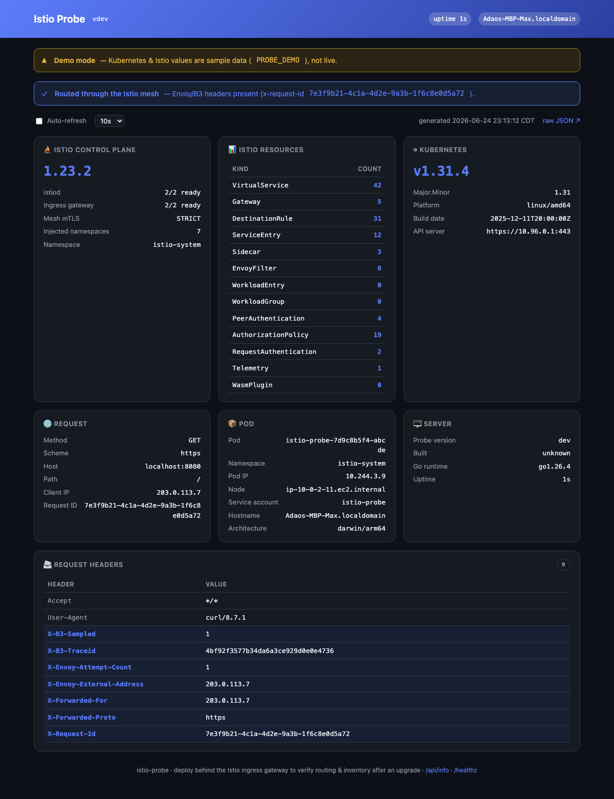

# istio-probe

A tiny in-cluster diagnostics page to **test & validate Istio after an upgrade**. Deploy it
behind the Istio ingress gateway, open it, and one page shows the request the mesh forwarded
plus a live inventory — **counts of every Istio resource type** (VirtualServices, Gateways,
DestinationRules, …), istiod version + readiness, the ingress gateway, mesh mTLS mode, and
injected-namespace count. One static Go binary, standard library only, distroless and non-root.




## What it shows

- **Istio resources** — a live count of every type: VirtualService, Gateway, DestinationRule,
  ServiceEntry, Sidecar, EnvoyFilter, WorkloadEntry/Group, PeerAuthentication, AuthorizationPolicy,
  RequestAuthentication, Telemetry, WasmPlugin.
- **Control plane** — istiod **version** (from its image tag) + readiness, the ingress gateway,
  mesh **mTLS mode** (from the root-namespace PeerAuthentication), and how many namespaces have
  sidecar injection enabled.
- **Request through the mesh** — the forwarded request with the Envoy/B3 headers highlighted
  (`x-request-id`, `x-b3-*`, `x-envoy-*`, `x-forwarded-*`) + a banner confirming it arrived via
  the mesh. Plus the Kubernetes version and pod identity.

Endpoints: **`/`** (page) · **`/api/info`** (everything as JSON) · **`/healthz`**.

## How it reads the cluster

It uses the **pod's ServiceAccount** token against the in-cluster Kubernetes API — no kubeconfig,
no long-lived credentials. That needs a small **read-only** ClusterRole (`get`/`list` on the Istio
CRDs + Deployments + Namespaces); it's in [`k8s/rbac.yaml`](k8s/rbac.yaml) and never writes anything.

## Deploy

```bash
# 1) edit k8s/rbac.yaml: set the ClusterRoleBinding subject namespace to where you deploy
kubectl apply -f k8s/rbac.yaml
kubectl apply -f k8s/deployment.yaml
kubectl apply -f k8s/service.yaml
# 2) expose it via the Istio ingress gateway (edit the host first)
kubectl apply -f k8s/gateway.yaml
```

Then browse the host — the green banner + Envoy headers confirm Istio routed to the pod, and the
cards show the inventory. Or, quickly, without the gateway:

```bash
kubectl port-forward deploy/istio-probe 8080:8080   # → http://localhost:8080
```

## Configuration

| Variable | Default | Purpose |
|----------|---------|---------|
| `ISTIO_NAMESPACE` | `istio-system` | where istiod / the ingress gateway run |
| `PORT` | `8080` | listen port |
| `PROBE_FACT_*` | — | each becomes a row in a **Facts** card (e.g. `PROBE_FACT_Mesh_ID`) |
| `PROBE_DEMO` | `false` | fill sample values for local previews (clearly flagged) |

## Run locally (no cluster)

```bash
docker run --rm -p 8080:8080 -e PROBE_DEMO=1 ghcr.io/junior/istio-probe   # sample data
# against a real cluster, run where you have kube access (it reads in-cluster config when present)
```

## Security

Single static binary on `distroless/static:nonroot` — **uid 65532**, **read-only root
filesystem**, **all capabilities dropped**, `RuntimeDefault` seccomp, no shell (~10 MB). Cluster
access is the pod's auto-rotating ServiceAccount token with a **read-only** ClusterRole.

## Develop

```bash
go run .              # → http://localhost:8080  (try PROBE_DEMO=1)
go test ./...
go vet ./... && gofmt -l .
```

## Releasing

Images publish to **GHCR** via [`.github/workflows/release.yml`](.github/workflows/release.yml)
— multi-platform (`linux/amd64`, `linux/arm64`), tagged `latest` + the semver version:

```bash
git tag v0.1.0 && git push origin v0.1.0
```

## License

[MIT](LICENSE).
